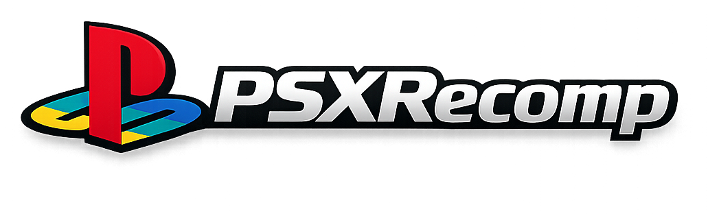

<p align="center">
  
</p>

# PSXRecomp — Titus Interactive recompilation toolkit

Static recompilation toolkit for **PlayStation 1** titles associated with
**Titus Interactive**: MIPS R3000A → C → native host executables, built on a
faithful PS1 hardware runtime.

Background on the original prototype:
[I Built a PS1 Static Recompiler With No Prior Experience (and Claude Code)](https://1379.tech/i-built-a-ps1-static-recompiler-with-no-prior-experience-and-claude-code/)

## What It Is

PSXRecomp translates PS1 MIPS binaries into C, then compiles that C as a
native executable linked against a PS1 hardware runtime. The v4 architecture
recompiles the real `SCPH1001.BIN` BIOS and runs it as the kernel. There is no
HLE BIOS layer, no stubs, and no general-purpose interpreter fallback for
static code.

The toolkit is aimed at bringing Titus Interactive–era PlayStation software
(and related titles you package yourself) to modern platforms as **native**
apps — not as a general-purpose multi-system emulator.

PSXRecomp is a **framework**. Game-specific packages are produced with
**PSXRecomp Studio** (or by linking this repository as a git submodule and
driving the recompiler + runtime yourself).

**New here?** Start with:

- [`docs/EXECUTION_MODEL.md`](docs/EXECUTION_MODEL.md) — how a game actually runs
- [`docs/ARCHITECTURE.md`](docs/ARCHITECTURE.md)
- [`docs/BUILDING.md`](docs/BUILDING.md)
- [`CONTRIBUTING.md`](CONTRIBUTING.md)

## Philosophy — toward 100% static recompilation

The goal is simple and absolute: **a PS1 game should run as native code, not be
emulated.** Every MIPS instruction the game executes should ideally have been
translated to C and compiled ahead of time. No interpreter on the hot path, no
HLE shims, no "good enough" approximation of the hardware — the recompiled BIOS
*is* the kernel, and the recompiled game *is* the game.

PS1 games make that goal hard in one specific way: **overlays.** Games stream
code off the disc into RAM at runtime and execute it, then overwrite it with the
next overlay. That code does not exist in the executable at build time, so a
pure ahead-of-time recompiler cannot see it. This is the frontier the project is
working through, and it is why this is an **alpha/beta**: today a *majority* of a
supported title can run as statically recompiled native code, but **not yet 100%.**

How we close the gap, without ever compromising correctness:

1. **Static first.** The main executable and the BIOS are fully recompiled
   ahead of time. This is the bulk of execution and it is always native.
2. **Capture → compile → cache for overlays.** As the game runs, overlays are
   captured the moment they load. Offline, each is recompiled to a native module
   keyed by its content, cached, and on later runs loaded and dispatched as
   native code *before* any fallback. Coverage grows as the game is played:
   every overlay someone reaches becomes native for everyone after.
3. **Interpreter failover — only for code that isn't static yet.** A small
   MIPS interpreter runs *runtime-installed* code (overlays/dirty RAM) that
   hasn't been captured-and-compiled. It is a safety net and a coverage feeder,
   never a substitute for recompiling static code, and never on the BIOS/main-EXE
   path.
4. **Precision over recall.** A piece of code we *haven't* compiled safely falls
   back to the interpreter and gets captured for next time — under-coverage
   self-heals. A piece we compile *wrong* would corrupt the machine, so the
   system biases hard toward correctness: native code is only dispatched when its
   source RAM is provably unchanged, and a registration is revoked the instant
   the RAM it was compiled from is overwritten.

Two honest bounds. **The worst case is always performance, never correctness** —
anything not yet native simply runs interpreted, correctly.

**Known corner case — genuinely self-modifying / per-load-relocated code.** Some
code is rewritten or relocated to *different bytes on every load*, so it is not
static by definition and cannot be recompiled ahead of time into a single
correct translation. **This code remains interpreted** — permanently, as far as
the current design is concerned, and that is an accepted, correct outcome (the
interpreter runs it faithfully; only speed is lost). It is a narrow corner, not
a wall.

The aspiration is **100% static coverage** — every reachable instruction native,
the interpreter idle.

## Status

| Subsystem | State |
|---|---|
| BIOS recompilation (`SCPH1001.BIN`) | Boots and hands off to packaged game EXEs |
| Game EXE recompilation | Studio pipeline + TOML-driven game projects |
| CD-ROM / MDEC / XA | Disc streaming and FMV path implemented |
| Memory cards | Save/load path implemented |
| SIO0 controllers | Digital pad, DualShock, Hybrid modes; keyboard + SDL + macOS GIP |
| GPU | Software + OpenGL present paths |
| Interrupts, COP0, timers | Working for current bring-up titles |
| Dirty-RAM support | BIOS/game RAM-installed dispatch paths handled |
| In-game settings / pause menu | Controllers, keyboard rebinds, video options |

Known follow-up work:

- SPU coverage is partial; reverb, noise, sweep, and accurate SPU IRQ behavior
  are not complete.
- Overlay capture → native cache coverage still depends on playthrough reach.
- Full end-to-end validation of every Titus-era title is ongoing; package each
  game with Studio and verify against real hardware / Beetle where needed.

## PSXRecomp Studio

`studio/` is the primary way to turn a legally obtained Titus Interactive
(or other PS1) BIN/CUE set into a signed native app:

- Disc analysis and evidence-backed MIPS→C generation
- Optional BIOS branding patch and direct-to-game boot
- Fixed controller pad type (Hybrid / Analog / D-Pad) baked into the package
- macOS / Windows / Linux packaging

See [`studio/README.md`](studio/README.md).

## Release Package

The framework release package is BIOS-only:

1. Download the platform zip from Releases.
2. Extract it and run the executable.
3. Select your legally obtained `SCPH1001.BIN` BIOS when prompted.

The package does not include a PS1 BIOS, game disc image, generated game code,
or save data. Game packages built with Studio prompt for a legally obtained
disc image in addition to the BIOS.

## Setup

Builds natively on **Windows (MSVC/MinGW)**, **macOS (Apple Silicon & Intel)**,
and **Linux**. The BIOS thread scheduler uses host fibers — Win32 Fibers on
Windows, `ucontext` on POSIX (`runtime/src/psx_fiber.c`).

Requirements at a glance (full details in [`docs/BUILDING.md`](docs/BUILDING.md)):

- A C/C++ toolchain: MSVC or MinGW/MSYS2 (Windows), Apple Clang (macOS),
  Clang/GCC (Linux). CMake 3.20+; on macOS/Linux also `ninja` and `pkg-config`.
- SDL2 (system / bundled); macOS also uses libusb for wired Xbox GIP pads that
  SDL cannot enumerate. RmlUi and FreeType come in as **git submodules** —
  clone with `--recurse-submodules`.
- A legally obtained `SCPH1001.BIN` BIOS dump. Not included.
- For game packages, a legally obtained game disc/EXE dump. Not included.

Build the framework (recompiler tool + BIOS-only runtime):

```sh
git clone --recurse-submodules https://github.com/mstan/psxrecomp.git && cd psxrecomp

cmake -S recompiler -B recompiler/build -G Ninja -DCMAKE_BUILD_TYPE=Release && cmake --build recompiler/build
cmake -S runtime    -B runtime/build    -G Ninja -DCMAKE_BUILD_TYPE=Release && cmake --build runtime/build --target psx-runtime
```

On Windows swap `-G Ninja` for your generator if you prefer; always keep an
explicit `-DCMAKE_BUILD_TYPE` so the generated C is optimized. Game projects
generate their own `generated/<serial>_*.c` files and link this runtime through
CMake — see [`docs/BUILDING.md`](docs/BUILDING.md#build-and-run-a-game).

## Keyboard Map

| PSX button | Keyboard |
|---|---|
| D-Pad Up / Down / Left / Right | Arrow keys |
| Cross | X |
| Square | Z |
| Circle | S |
| Triangle | A |
| L1 / R1 | Q / W |
| L2 / R2 | E / R |
| L3 / R3 (stick clicks) | T / Y |
| Start | Enter |
| Select | Right Shift |
| Turbo | Tab (hold) |
| Fullscreen | F11 / Alt+Enter / Cmd+F |

## Controller Map

Xbox-style controller defaults are enabled when a controller is connected:

| PSX button | Xbox controller |
|---|---|
| D-Pad Up / Down / Left / Right | D-pad or left stick |
| Cross | A |
| Circle | B |
| Square | X |
| Triangle | Y |
| L1 / R1 | LB / RB |
| L2 / R2 | LT / RT |
| L3 / R3 | Left / right stick click |
| Start | Menu |
| Select | View / Back |

Release builds create/use `input.ini` next to the executable. Edit that file to
change controller device index, deadzone, or button mapping.

On macOS, the launcher also lists supported wired PDP, Microsoft Xbox One/Series,
and PowerA GIP controllers as **direct USB** devices when SDL cannot expose them.

Studio packages can lock the emulated pad type (Hybrid / Analog / D-Pad) so the
in-game menu does not offer a per-session pad switch.

## Architecture

The recompiler emits C functions and dispatch tables for BIOS and game code.
The runtime loads the BIOS/game assets into emulated PS1 memory, links the
generated C as native code, and simulates hardware through MMIO handlers for
GPU, DMA, timers, CD-ROM, MDEC, SIO0, memory cards, SPU, GTE, and interrupt
delivery. The recompiled `SCPH1001.BIN` is the low-level (LLE) kernel and the
correctness oracle; an optional HLE tier lays instant boot-skip and a few BIOS
services on top, always falling through to the recompiled BIOS.

Code that can't be seen ahead of time (disc-streamed **overlays**) is captured
and compiled to native code the first time it appears, with a small interpreter
as the correctness fallback until it is. Full story in
[`docs/EXECUTION_MODEL.md`](docs/EXECUTION_MODEL.md); component-level detail in
[`docs/ARCHITECTURE.md`](docs/ARCHITECTURE.md).

See [`CONTRIBUTING.md`](CONTRIBUTING.md) and [`CLAUDE.md`](CLAUDE.md) for the
development rules, and [`docs/internal/`](docs/internal/) for phased plans and
deep design notes.

## Disc Speed

Per-game `disc_speed` in `game.toml [runtime]` compresses CD-ROM timing:

| Value | Effect |
|---|---|
| `"1x"` | Authentic PSX timing. Default for all games. |
| `"2x"` / `"4x"` | 2× / 4× faster reads and seeks. |
| `"instant"` | Minimum-floor delays. **Known to hang some games** during early initialization; root cause not yet identified. Use `"4x"` instead until resolved. |

FMV playback is always protected: the CD-ROM layer reverts to 1× whenever XA
audio streaming is active, regardless of `disc_speed`. Boot and the license
screen always run at authentic 1×.

## Help make your game faster — just by playing it

**Why isn't the game already at full speed everywhere?** Most of a game's
code is converted ("recompiled") into a fast native program ahead of time.
But PlayStation games don't keep all of their code on screen at once — they
stream extra chunks of code off the disc as you reach new areas (these
chunks are called *overlays*). We can't convert a chunk we've never seen,
and the only way to see it is for someone to actually visit that area.
Until then, that area's code runs in a slower compatibility mode.

**You can help, just by playing.** While you play, the game quietly notices
which areas are still running in the slow mode, takes a snapshot of them,
and converts them to fast native code in the background — often within a
minute, while you keep playing. The more places you visit, the faster the
game gets. This happens automatically; you don't have to do anything.

**Your discoveries persist for you.** They are saved in a file written next
to the game called `overlay_captures.json`, and your local cache is rebuilt
from it automatically — areas you have visited stay fast on every later
session.

**Please do not post `overlay_captures.json` publicly.** The file contains
verbatim snapshots of the game's code read from your disc, which is
copyrighted material — keep it on your own machine, alongside your disc
image. A metadata-only contribution format (addresses and checksums, no
game code) is planned so discoveries can be shared safely in the future.

## Contributing

Contributions are welcome — AI-assisted or not — as long as they're reviewed,
tested, and keep the core game-agnostic. A few things hold this project together:
the faithful recompiled BIOS is the baseline and oracle, generated code is never
hand-edited (fix the recompiler and regenerate), and a change proves itself
against the Beetle oracle / on screen rather than by assertion.

Read [`CONTRIBUTING.md`](CONTRIBUTING.md) before opening a PR. Bugs and build
problems go to GitHub issues (include `gcc -v` / OS / generator for build
failures); design discussion happens in the **R.A.I.D.** Discord (invite below).

## License

PolyForm Noncommercial 1.0.0. See `LICENSE`.

The PSX BIOS, Titus Interactive (and other) game disc images, and related
assets remain copyrighted by their respective owners. This project distributes
no BIOS images, no disc images, and no game assets — those are always supplied
by the user from their own collection. Release executables (and per-game
overlay caches) contain statically recompiled (machine-translated) builds of
the original code, the same distribution model used by other static
recompilation projects such as N64: Recompiled.

---

<p align="center">
  <sub><b>R.A.I.D. — Retro AI Development</b> · a Discord for AI-assisted retro reverse-engineering, decomp &amp; recomp</sub>
</p>

<p align="center">
  <a href="https://discord.gg/Ad9BwSzctP">Join the R.A.I.D. Discord</a>
</p>
